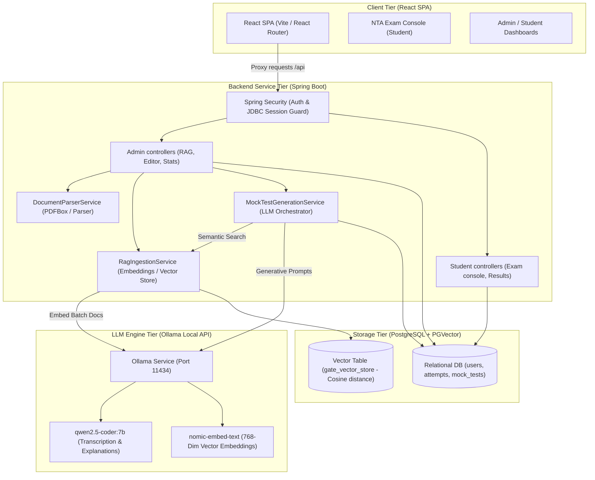

# GATE MockAI 🎓
### AI-Powered Academic Assessment & Smart RAG Mock Exam Platform

GATE MockAI is a production-grade, AI-aligned assessment platform built to ingest, draft, manage, and simulate syllabus-aligned GATE Mock Exams. By combining a split-architecture **React Single Page Application (SPA)** with a **Spring Boot REST API** and a **Retrieval-Augmented Generation (RAG)** pipeline powered by local LLMs (via Ollama), the system provides an end-to-end sandbox for creating, indexing, and emulating high-fidelity, NTA-style GATE examinations.

---

## 🚀 Key Features

* **High-Fidelity NTA Emulation**: A replica of the National Testing Agency (NTA) exam console, complete with question palettes, calculator, section navigation (General Aptitude & Computer Science), countdown timers, and strict submission rules.
* **Semantic RAG Ingestion Pipeline**: Ingests official GATE past papers from PDFs using a **3-page overlapping chunking window** to ensure questions spanning page boundaries are captured without truncation.
* **Advanced Answer Key Parser**: A Java-based regex parser that extracts answers, scoring models, and tolerances from official keys, linking options and NAT values programmatically.
* **Semantic Search Generation**: Similarity search powered by local vector embedding maps the admin's syllabus configuration to database context, grounding LLM exam generation in real historical questions.
* **Persistent Session Store**: Spring Session backed by JDBC (PostgreSQL) preserves administrator and student login sessions across application restarts or rebuilds.

---

## 🏗️ System Architecture

The application is structured into four main tiers: a React Client Tier, a Security & API Service Tier, a Relational/Vector Storage Tier, and a Local Inference Tier.



---

## 📊 Database Schema

Our database uses PostgreSQL. Schema migrations are managed via **Flyway**, and embeddings are stored inside a PGVector table with `COSINE_DISTANCE` mapping.

```mermaid
erDiagram
    users {
        uuid id PK
        varchar email UNIQUE
        text password_hash
        varchar full_name
        varchar role "ADMIN | STUDENT"
        timestamp created_at
    }
    
    mock_tests {
        uuid id PK
        varchar title
        varchar topic
        varchar subject
        varchar branch
        varchar year_label
        integer duration_minutes
        numeric total_marks
        boolean is_published
        timestamp created_at
    }
    
    questions {
        uuid id PK
        uuid test_id FK
        text question_text
        text image_path
        varchar type "MCQ | MSQ | NAT"
        double correct_nat_value
        double nat_tolerance
        numeric marks
        numeric negative_marks
        integer sequence_no
        text explanation
    }
    
    options {
        uuid id PK
        uuid question_id FK
        char option_label "A | B | C | D"
        text option_text
        text image_path
        boolean is_correct
    }
    
    attempts {
        uuid id PK
        uuid user_id FK
        uuid test_id FK
        numeric score
        timestamp started_at
        timestamp submitted_at
        varchar status "IN_PROGRESS | SUBMITTED | TIMED_OUT"
    }
    
    attempt_answers {
        uuid id PK
        uuid attempt_id FK
        uuid question_id FK
        text selected_option_ids "Comma-separated"
        double nat_value_entered
        boolean is_correct
        numeric marks_awarded
    }
    
    branches {
        uuid id PK
        varchar name
        varchar code UNIQUE
    }
    
    branch_subjects {
        uuid id PK
        uuid branch_id FK
        varchar name
        integer default_marks_weightage
        integer display_order
        boolean is_active
    }

    users ||--o{ attempts : places
    mock_tests ||--o{ questions : contains
    mock_tests ||--o{ attempts : receives
    questions ||--o{ options : has
    attempts ||--o{ attempt_answers : contains
    questions ||--o{ attempt_answers : answered-by
    branches ||--o{ branch_subjects : "defines subjects for"
```

---

## 🧠 How RAG Works

The RAG architecture enables grounding mock tests in actual historical exam papers, improving question validity and formatting.

### 1. Ingestion & Pre-processing (PDF Upload)
* **3-Page Overlapping Chunking**: During past paper PDF parsing, the text is extracted and grouped into page blocks of 3 pages (with a 1-page overlap, i.e., Pages 1–3, 3–5, 5–7). This window ensures that split-page questions are kept together in a single block.
* **LLM Transcription**: The raw chunk is passed to `qwen2.5-coder:7b` to isolate academic questions, structures, and choices into a draft JSON array. 
* **Java Post-Processing & Deduplication**:
  - Duplicate questions resulting from the overlapping page chunks are resolved in Java by grouping by `Section + SequenceNo` and keeping the candidate with the longest text payload.
  - An answer key text (or PDF) is concurrently parsed using a multi-pattern regex engine (`DocumentParserService`). 
  - Answers are matched to options, correct choices are flagged, NAT bounds are calculated, and mark weights (with negative markings) are derived from the key map.
  - Questions are sorted sequentially: General Aptitude (`GA_1` to `GA_10`) followed by Computer Science (`CS_1` to `CS_55`), and sequence numbers are rewritten from 1 to 65.

### 2. Embeddings & Persistence
* The confirmed test is saved relationally in PostgreSQL.
* The content from the questions (subject, topic, question, explanation) is converted into Spring AI Document entities.
* The documents are embedded using `nomic-embed-text` in batches of 10 to avoid local Ollama engine timeout and stored inside `gate_vector_store` (`pgvector`).

### 3. Exam Generation Flow
* When an admin generates a new mock test, they specify subject weightages (e.g., Databases: 8 marks, Operating Systems: 8 marks).
* The service queries PGVector with semantic similarity searches for each topic.
* The returned similarity context (the top 5 matching historical questions) is injected into the LLM prompt template (`generate_mock_test.st`) as grounding data.
* Grounded in actual past exam papers, the local LLM generates syllabus-compliant mock tests.

---

## 🛠️ Technology Stack

* **Frontend**: React (Vite, React Router, TailwindCSS `@import`)
* **Backend**: Spring Boot 3.3.4 (Java 17/25)
* **AI Core**: Spring AI 1.1.1
* **LLM Engine**: Ollama (Local Server)
  - Text Model: `qwen2.5-coder:7b`
  - Embedding Model: `nomic-embed-text` (768 Dimensions)
* **Database**: PostgreSQL 16 + PGVector Extension
* **Migrations**: Flyway Schema Migrations
* **Sessions**: Spring Session JDBC (PostgreSQL Persistent Store)
* **Security**: Spring Security 6 (Persistent cookies, Role routing, BCrypt encoding)

---

## ⚙️ Quick Start

### 1. Prerequisites
* **Java**: JDK 17 or higher
* **Node.js**: v18+ & npm
* **Docker**: Docker Desktop (for Postgres database container)
* **Ollama**: Installed and running on host/container port `11434`
  ```bash
  # Pull the configured models
  ollama pull qwen2.5-coder:7b
  ollama pull nomic-embed-text
  ```

### 2. Spin up Database and Vector Container
Start the PostgreSQL container on port `5439` using Docker Compose:
```bash
docker compose up -d
```

### 3. Boot Up the Backend
Run the Spring Boot application (will auto-apply migrations and prepare PGVector schemas):
```bash
mvn clean compile spring-boot:run
```

### 4. Boot Up the Frontend Dev Server
Navigate into the `frontend` directory, install dependencies, and launch Vite:
```bash
cd frontend
npm install
npm run dev
```

The application is now accessible at **[http://localhost:5173](http://localhost:5173)**.

---

## 🔑 Default Credentials
* **Admin Account**: `admin@gate.com` / `Admin@123`
* **Student Account**: Register a new student account using the signup form (`/register`).
