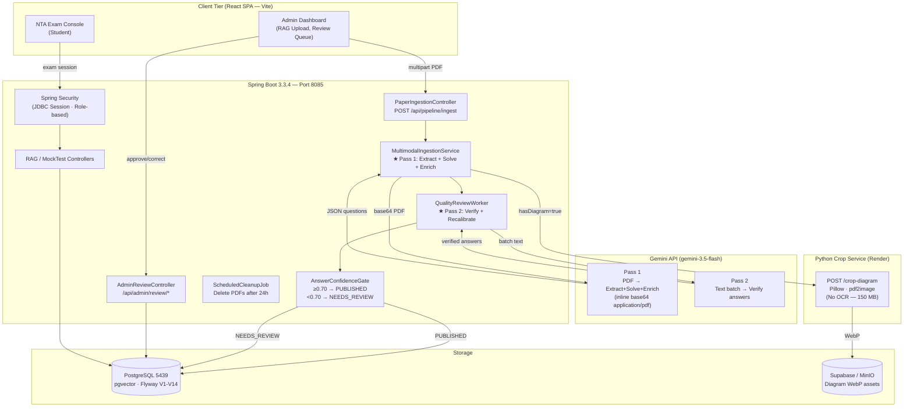
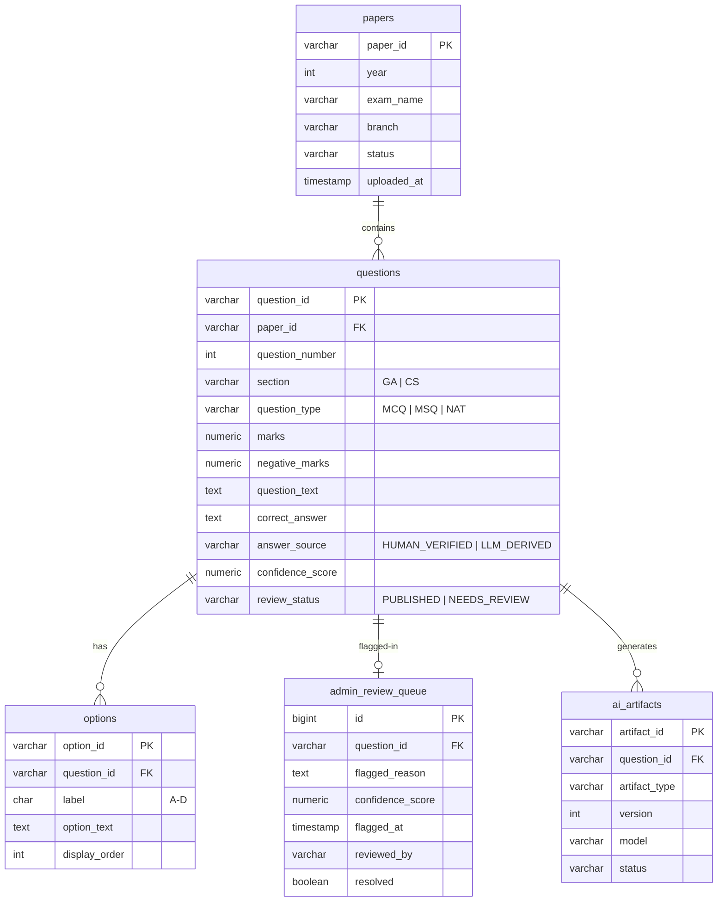
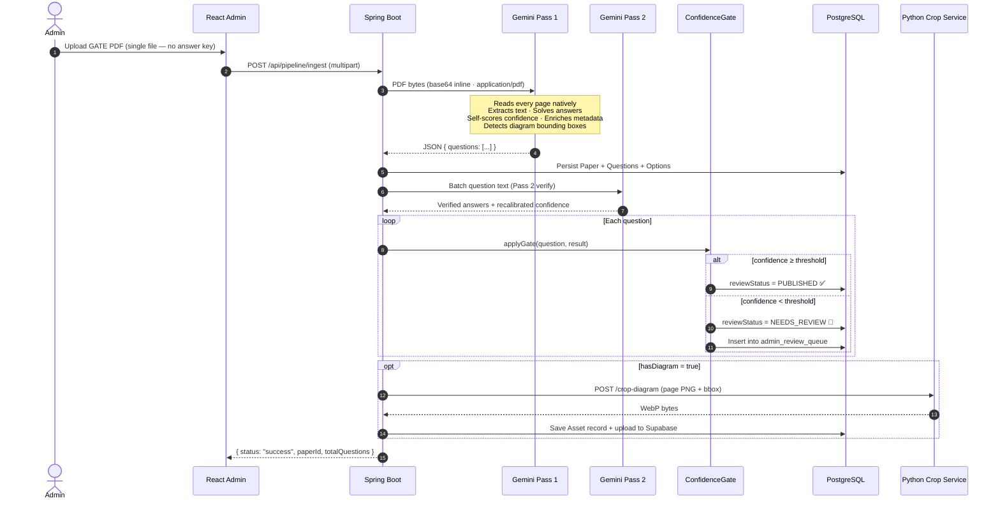

# GateMockAI
### AI-Powered GATE Exam Platform — v2.1 (Gemini Multimodal)

> **Team CodeDrip** · Piyush · Production-grade GATE exam ingestion, enrichment & mock exam simulator

---

## 🚀 What's New in v2.1

| | v1 (Ollama + OCR) | **v2.1 (Gemini Multimodal)** |
|---|---|---|
| PDF reading | Python OCR (PaddleOCR / PyMuPDF) | **Gemini reads PDF natively** |
| Answer keys | Separate PDF required | **Removed — Gemini solves directly** |
| Gemini calls / paper | 5 × N questions | **2 calls flat** |
| Local LLM | Ollama (qwen2.5-coder:7b) required | **Not required** |
| Python service memory | ~2 GB (OCR models) | **~150 MB (crop only)** |
| Low-confidence answers | No gate | **Admin Review Queue** |

---

## ✨ Key Features

- **Multimodal Ingestion** — Upload a single GATE PDF; Gemini reads every page, extracts all questions, solves them, and enriches them with explanations, hints, and difficulty metadata in one pass.
- **Answer Confidence Gate** — Questions where Gemini scores < 70% confidence are hidden from students and queued for admin review instead of being published blindly.
- **Admin Review Queue** — Premium dark-themed dashboard at `/admin/review-queue` to approve or correct AI-derived answers before students see them.
- **2-Pass Quality Pipeline** — Pass 1 extracts + solves + enriches. Pass 2 (`QualityReviewWorker`) independently verifies every answer and recalibrates confidence.
- **Diagram Crop Service** — Lightweight Python helper (Render-hosted) crops diagram bounding boxes returned by Gemini into WebP assets stored in Supabase.
- **High-Fidelity NTA Exam Console** — Full replica of the NTA exam interface with section navigation, virtual calculator, palette, timer, and anti-cheat fullscreen enforcement.
- **Scheduled PDF Cleanup** — Raw PDFs are auto-deleted from object storage 24h after enrichment to save disk space.

---

## 🏗️ System Architecture



---

## 📊 Database Schema (V1–V14)



---

## 🧠 How Ingestion Works (v2.1)



---

## 🛠️ Technology Stack

| Layer | Technology |
|-------|-----------|
| **Frontend** | React 18 · Vite · React Router · Vanilla CSS |
| **Backend** | Spring Boot 3.3.4 · Java 17 · Spring Security 6 |
| **AI Model** | Gemini 3.5 Flash (Google Generative Language API) |
| **Database** | PostgreSQL 16 · pgvector · Flyway (V1–V14) |
| **Object Storage** | Supabase Storage / MinIO (S3-compatible) |
| **Sessions** | Spring Session JDBC (30-day persistent cookies) |
| **Python Service** | FastAPI · Pillow · pdf2image · Render.com |
| **Build** | Maven 3 · npm |

> **Ollama is no longer required.** All AI work is done via the Gemini API.

---

## ⚙️ Quick Start

### 1. Prerequisites

| Requirement | Version | Notes |
|-------------|---------|-------|
| Java | 17+ | |
| Node.js | 18+ | |
| Docker | Desktop | For PostgreSQL |
| Gemini API Key | — | Set `GEMINI_API_KEY` env var |

### 2. Set Environment Variables

```bash
export GEMINI_API_KEY=your_key_here
# Optional — only if deploying diagram crop service on Render:
# export CROP_SERVICE_URL=https://gate-diagram-crop-service.onrender.com
```

### 3. Start PostgreSQL

```bash
docker compose up -d
```

### 4. Start Spring Boot Backend

```bash
mvn spring-boot:run
# Flyway auto-applies V1–V14 migrations on first boot
# App starts on http://localhost:8085
```

### 5. Start Frontend Dev Server

```bash
cd frontend
npm install
npm run dev
# App available at http://localhost:5173
```

---

## 📡 Key API Endpoints

### Pipeline (Admin only)

| Method | Endpoint | Description |
|--------|----------|-------------|
| `POST` | `/api/pipeline/ingest` | Upload PDF → Gemini extraction + enrichment |
| `POST` | `/api/pipeline/enrich/{paperId}` | Re-run Pass 2 for an existing paper |
| `GET` | `/api/pipeline/status/{paperId}` | Check pipeline progress |
| `GET` | `/api/pipeline/papers` | List all ingested papers |
| `DELETE` | `/api/pipeline/papers/{paperId}` | Delete paper + all questions |

### Admin Review Queue (Admin only)

| Method | Endpoint | Description |
|--------|----------|-------------|
| `GET` | `/api/admin/review/queue` | Paginated list of low-confidence questions |
| `GET` | `/api/admin/review/queue/count` | Count badge for sidebar |
| `POST` | `/api/admin/review/{questionId}/approve` | Confirm AI answer → PUBLISHED |
| `POST` | `/api/admin/review/{questionId}/correct` | Override answer → PUBLISHED |

### Ingest Request Example

```bash
curl -X POST http://localhost:8085/api/pipeline/ingest \
  -H "Cookie: JSESSIONID=your_session" \
  -F "questionPaper=@gate_cse_2020.pdf" \
  -F "paperId=gate_cse_2020" \
  -F "examName=GATE CSE 2020" \
  -F "year=2020" \
  -F "branch=CSE"
```

---

## 🔑 Default Credentials

| Role | Email | Password |
|------|-------|----------|
| Admin | `admin@gate.com` | `Admin@123` |
| Student | Register via `/register` | — |

---

## 📁 Project Structure

```
GateMockAI/
├── src/main/java/com/gate/mockexam/
│   ├── pipeline/
│   │   ├── ingestion/          # MultimodalIngestionService · IngestedQuestionResult · DiagramCropService
│   │   ├── enrichment/         # QualityReviewWorker · AnswerConfidenceGate · EnrichmentPipelineService
│   │   ├── controller/         # PaperIngestionController · AdminReviewController
│   │   ├── domain/             # GateQuestion · Paper · AdminReviewItem · GateOption · Asset
│   │   └── repository/         # JPA repositories
│   ├── service/                # MockTest · RAG · Gemini usage tracking
│   └── config/                 # Security · MinIO · Async
├── src/main/resources/
│   ├── application.yml
│   └── db/migration/           # Flyway V1–V14
├── frontend/src/
│   ├── components/
│   │   ├── AdminRag.jsx        # PDF upload (answer key removed)
│   │   ├── AdminReviewQueue.jsx # ★ Premium review queue UI
│   │   └── ConfidenceBadge.jsx # AI confidence indicator badge
│   └── store/examStore.js
└── extraction-service/         # Python FastAPI — diagram crop only
    ├── app/main.py             # POST /crop-diagram · GET /health
    ├── requirements.txt        # Pillow · pdf2image (no OCR)
    ├── Dockerfile
    └── render.yaml
```

---

## 🚢 Deploying the Python Crop Service to Render

```bash
# 1. Push extraction-service/ to a GitHub repo
# 2. Create a new Web Service on render.com
# 3. Connect the repo, set build command:
#      pip install -r requirements.txt
# 4. Set start command:
#      uvicorn app.main:app --host 0.0.0.0 --port $PORT
# 5. Copy the service URL to application.yml:
#      pipeline.crop-service-url: https://your-service.onrender.com
```

---

## 🔒 Security

- All `/api/pipeline/**` and `/api/admin/**` routes are restricted to `ROLE_ADMIN`
- Spring Session JDBC persists sessions across restarts (30-day cookie lifetime)
- `GEMINI_API_KEY` is never logged; loaded via `${GEMINI_API_KEY}` env var only
- NEEDS_REVIEW questions are fully hidden from all student-facing endpoints until approved
