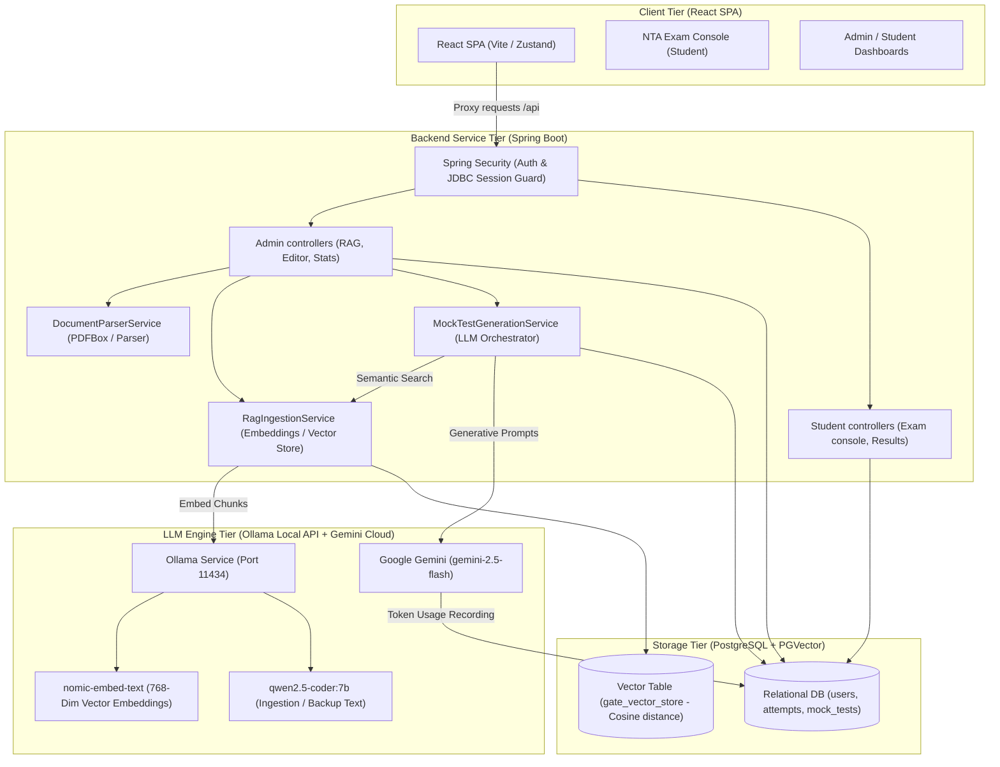
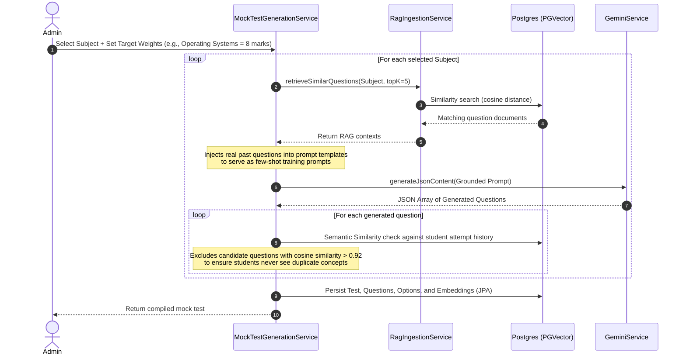

# GATE MockAI: Complete Developer Agent Onboarding Guide & System Handbook

This document serves as the absolute source of truth and onboarding manual for any AI or developer agent working on the **GATE MockAI** platform. It provides a complete, top-to-bottom explanation of the system architecture, database layout, backend APIs, frontend states, implementation details of core services (RAG, generation, spaced repetition, analytics), security configuration, resolved engineering bugs, and execution instructions.

---

## 1. System Overview

**GATE MockAI** is an AI-aligned, production-grade assessment sandbox built to ingest historical past exam papers, dynamically compile syllabus-aligned tests, and emulate the official Indian National Testing Agency (NTA) exam console.

### Key Users:
*   **Students**: Register, practice with personalized mock exams, review step-by-step solutions, track score improvements, and use spaced repetition review boards.
*   **Administrators**: Ingest past GATE exams (PDF papers + keys), inspect system token usage, configure custom subject weights, edit questions, and analyze student analytics.

---

## 2. Core Architecture

The system utilizes a split-architecture layout:



### Infrastructure Components & Rationale:
1.  **PostgreSQL 16 + `pgvector`**: Combines relational tracking (users, test attempts, results) and 768-dimensional question vector indexing in a single transactional database. Eliminates the overhead of separate vector database engines.
2.  **Ollama (Local LLM Runtime)**: Runs the 768-dimensional `nomic-embed-text` model offline for semantic search query embeddings, guaranteeing zero cost for localized similarity operations.
3.  **Google Gemini (`gemini-2.5-flash`)**: Serves as the primary Generative AI cloud orchestrator. Gemini's 1M+ token context window permits sending entire multi-page exam PDFs and keys in a single request, eliminating local PDF parsing truncation bugs.
4.  **Spring Session JDBC**: Offloads user sessions from JVM memory into Postgres table schemas (`SPRING_SESSION`). Prevents developer timeouts and user logout events when the Spring Boot server hot-rebuilds.

---

## 3. Database Schema & Data Models

The relational tables are managed and versioned using **Flyway migrations** (`src/main/resources/db/migration/`).

### Entity-Relationship Diagram (ERD)

```mermaid
erDiagram
    users {
        uuid id PK
        varchar email UNIQUE
        text password_hash
        varchar full_name
        varchar role "ADMIN | STUDENT"
        timestamp created_at
    }
    
    mock_tests {
        uuid id PK
        varchar title
        varchar topic
        varchar subject
        varchar branch
        varchar year_label
        integer duration_minutes
        numeric total_marks
        boolean is_published
        timestamp created_at
    }
    
    questions {
        uuid id PK
        uuid test_id FK
        text question_text
        text image_path
        varchar type "MCQ | MSQ | NAT"
        double correct_nat_value
        double nat_tolerance
        numeric marks
        numeric negative_marks
        integer sequence_no
        text explanation
        vector embedding "768 Dimensions"
    }
    
    options {
        uuid id PK
        uuid question_id FK
        char option_label "A | B | C | D"
        text option_text
        text image_path
        boolean is_correct
    }
    
    attempts {
        uuid id PK
        uuid user_id FK
        uuid test_id FK
        numeric score
        timestamp started_at
        timestamp submitted_at
        varchar status "IN_PROGRESS | SUBMITTED | TIMED_OUT"
    }
    
    attempt_answers {
        uuid id PK
        uuid attempt_id FK
        uuid question_id FK
        text selected_option_ids "Comma-separated"
        double nat_value_entered
        boolean is_correct
        numeric marks_awarded
        integer time_spent_seconds
        integer repetitions "SM-2 counter"
        integer interval_days "SM-2 interval"
        double ease_factor "SM-2 multiplier"
        date next_review "SM-2 schedule"
    }
    
    branches {
        uuid id PK
        varchar name
        varchar code UNIQUE
    }
    
    branch_subjects {
        uuid id PK
        uuid branch_id FK
        varchar name
        integer default_marks_weightage
        integer display_order
        boolean is_active
    }

    gemini_token_usage {
        uuid id PK
        varchar call_type
        integer prompt_tokens
        integer candidate_tokens
        integer total_tokens
        timestamp created_at
    }

    users ||--o{ attempts : places
    mock_tests ||--o{ questions : contains
    mock_tests ||--o{ attempts : receives
    questions ||--o{ options : has
    attempts ||--o{ attempt_answers : contains
    questions ||--o{ attempt_answers : answered-by
    branches ||--o{ branch_subjects : defines
```

### Table Definitions & Roles:
*   **`users`**: Manages credentials, hashing passwords using BCrypt. Segregates permissions into `ROLE_ADMIN` and `ROLE_STUDENT`.
*   **`mock_tests`**: Serves as metadata containers representing compiled exams, storing titles, topics, branches, total marks, and limits.
*   **`questions`**: Maps test items. Contains type triggers (`MCQ` (Multiple Choice), `MSQ` (Multiple Select), `NAT` (Numerical Answer Type)), marks weightage, negative marking rules, text explanations, and a nullable `embedding` column of type `vector(768)` to support local duplicate detection.
*   **`options`**: Holds individual selections (A, B, C, D) for MCQ and MSQ questions, flagged with an `is_correct` boolean.
*   **`attempts` & `attempt_answers`**: Stores active exam sessions. Tracks intermediate inputs (`selected_option_ids` / `nat_value_entered`) and captures time spent per question (`time_spent_seconds`). It also houses the **SM-2 spaced repetition scheduler columns**: `repetitions`, `interval_days`, `ease_factor`, and `next_review`.
*   **`gate_vector_store`**: Maintained by Spring AI. Houses embedded past questions used for semantic Retrieval-Augmented Generation context matching.
*   **`gemini_token_usage`**: Logs prompt, candidate, and aggregate token metrics for external Gemini API invocations to estimate dollar costs.

---

## 4. Key Functional Pipelines & Services

### A. Past Paper Ingestion Pipeline (PDF to Vector Store)
Administrators can upload historical GATE papers and answer key documents. The ingestion service extracts, aligns, and saves them to PGVector:

```mermaid
sequenceDiagram
    autonumber
    actor Admin
    participant Ctrl as AdminRagController
    participant Parser as DocumentParserService
    participant Gemini as GeminiService (2.5 Flash)
    participant DB as Postgres (JPA + PGVector)
    
    Admin->>Ctrl: Upload PDF Paper + Key PDF
    Ctrl->>Parser: parsePdf(AnswerKeyPDF)
    Parser-->>Ctrl: Raw Key Text
    Ctrl->>Parser: parseAnswerKeyToMap(KeyText)
    Parser-->>Ctrl: Map<Section_QNo, AnswerKeyEntry>
    
    Ctrl->>Gemini: transcribePdfToQuestions(QuestionPDF, ManualKeyText)
    Note over Gemini: Utilizes 2.5 Flash native PDF ingestion<br/>in a single multimodal context block
    Gemini-->>Ctrl: Structured Questions JSON Array
    
    Note over Ctrl: Programmatic Post-Processing:<br/>1. Deduces question types (MCQ/MSQ/NAT)<br/>2. Binds correct option flags / tolerance ranges<br/>3. Calculates negative marks based on key rules<br/>4. Sorts GA first, CS second; assigns sequence Nos
    
    Ctrl->>DB: Persist Test, Questions, and Options (JPA)
    
    Note over Ctrl: Async Explanation Pass (Ollama Thread Pool):<br/>Generates detailed solution logic for each question
    Ctrl->>DB: Update questions with explanations
    
    Note over Ctrl: Vectorization Phase:<br/>Converts to Spring AI Document (Question Text + Explanation)
    Ctrl->>DB: Ingest vector embeddings to gate_vector_store
    Ctrl-->>Admin: Return success status
```

#### Advanced Parsing Logics:
*   **Answer Key Regex Parsing**: `DocumentParserService` matches keys against three distinct patterns:
    1.  *Table Rows*: `1 6 MCQ GA D 1` (Extracts question number, type, section, correct key, and marks).
    2.  *Prefixed Headers*: `GA 1: D` or `CS 17: 0.125 to 0.125` (Extracts section, number, and options/values).
    3.  *Simple Lists*: `1: D` (Uses section headers to switch active evaluation contexts).
*   **NAT Tolerance Calculations**: If the key contains a range (e.g., `0.125 to 0.125` or `12 to 14`), the parser computes:
    $$\text{correctNatValue} = \frac{\text{high} + \text{low}}{2}$$
    $$\text{natTolerance} = \frac{\text{high} - \text{low}}{2}$$

---

### B. Weighted Mock Test Generation Pipeline
Generates fresh mock exams using vector database search combined with template prompting.



#### Advanced Generation Controls:
*   **Adaptive Difficulty Adjustments**: The generator checks the student's historical subject accuracy:
    *   *High Accuracy ($\ge 75\%$)*: Injects prompt instructions to generate challenging questions with complex edge cases, shifting the 2-mark question distribution weight to $65\%$.
    *   *Low Accuracy ($\le 40\%$)*: Requests straightforward questions testing fundamental recall, lowering the 2-mark weight to $30\%$.
*   **Rate & Cost Limits**:
    *   Limits test generation requests to a maximum of **15 questions per test**.
    *   Limits aggregate generations to a maximum of **5 tests per hour** per system.

---

### C. Spaced Repetition Service (SuperMemo-2)
Implements the core **SM-2 algorithm** in `SpacedRepetitionService.java` to schedule review intervals based on student performance.

#### The Algorithm:
1.  **Response Grading**: When an attempt is submitted, the system maps answer accuracy to a quality score ($q$ from 0 to 5):
    *   *Incorrect response*: $q = 1$
    *   *Partially correct response*: $q = 3$
    *   *Fully correct response*: $q = 5$
2.  **Scheduling Calculation**:
    *   If quality is correct ($q \ge 3$):
        *   If repetitions $n = 0 \implies$ set review interval $I = 1$ day.
        *   If repetitions $n = 1 \implies$ set review interval $I = 6$ days.
        *   If repetitions $n > 1 \implies$ set review interval $I = \text{round}(I_{\text{prev}} \times EF)$.
        *   Increment repetitions count: $n = n + 1$.
    *   If quality is incorrect ($q < 3$):
        *   Reset repetitions count: $n = 0$.
        *   Reset review interval: $I = 1$ day.
3.  **Ease Factor ($EF$) Update**:
    $$EF_{\text{new}} = EF_{\text{prev}} + (0.1 - (5 - q) \times (0.08 + (5 - q) \times 0.02))$$
    *Note: Ease Factor is capped at a minimum value of 1.3 to avoid interval stagnation.*
4.  **Revision Test Compiler**: Compiles customized mock exams using questions flagged as due (`next_review <= LocalDate.now()`). The compiler copies existing database questions directly, bypassing external AI models entirely, achieving **zero API token cost**.

---

### D. NTA Exam Console & State Machine (Zustand Frontend)
The frontend exam environment utilizes **Zustand** (`frontend/src/store/examStore.js`) to enforce strict Indian National Testing Agency (NTA) standards.

*   **Zustand States Tracked**:
    *   `questions`: Complete array of test items.
    *   `activeQuestionIndex`: Pointer to the active question.
    *   `questionStates`: Mapping array tracking palette colors:
        *   `NOT_VISITED` (Gray)
        *   `NOT_ANSWERED` (Red)
        *   `ANSWERED` (Green)
        *   `MARKED` (Purple)
        *   `MARKED_ANSWERED` (Purple with Green circle badge)
    *   `answersCache`: Holds intermediate responses, synced to the backend `/api/exam/{id}/save` on every question transition.
    *   `timeSpentMap`: Key-value map accumulating time spent (`time_spent_seconds`) per question.
*   **Security & Anti-Cheat Safeguards**:
    *   **Fullscreen Guard**: Monitors window events. Focus shifts or exits from fullscreen increment the `fullscreenViolationsCount` state, blocking the view with a warning overlay until dismissed.
    *   **Auto-Submit**: Triggered instantly when `timeLeft` reaches 0.

---

## 5. Key Coding Challenges & Engineering Log

### Challenge 1: LaTeX Backslash Escaping in JSON Deserialization
*   **Problem**: GATE questions contain complex math blocks written in LaTeX (e.g., `\sum`, `\theta`, `\cap`). When Gemini returned these symbols inside JSON strings, JSON parsers failed to parse them, raising invalid escape sequence exceptions because backslashes inside JSON strings must be escaped.
*   **Solution**: Implemented a helper function `escapeJsonBackslashes(String json)` in the ingestion and generation controllers. The code inspects backslashes: if it is followed by a valid JSON escape character (`"`, `\`, `/`, `b`, `f`, `n`, `r`, `t` or `uXXXX`), it leaves it untouched; otherwise, it double-escapes it (`\\theta`), preserving the mathematical markup for rendering in the frontend.

### Challenge 2: Socket/Read Timeouts during Heavy LLM Inference
*   **Problem**: Ingestion of complete papers or generating mock tests takes up to several minutes. Spring Boot's default RestClient timed out, raising connection exceptions.
*   **Solution**: Configured custom timeouts in `AppConfig.java`. Injected a `SimpleClientHttpRequestFactory` with a `connectTimeout` of **30 seconds** and a `readTimeout` of **10 minutes** (`600,000ms`) into Spring AI's HTTP configuration.

### Challenge 3: GPU VRAM Memory Crashes under Concurrency
*   **Problem**: Running parallel ingestion worker threads caused local Ollama vectorization services to run out of video memory, crashing the server.
*   **Solution**: Registered a dedicated `ExecutorService` bean named `ollamaChunkExecutor` configured as a fixed thread pool of size 3 in `AppConfig.java`, limiting concurrent LLM calls and stabilizing the local GPU.

### Challenge 4: Ingestion Duplication from Overlapping Windows
*   **Problem**: Using an overlapping chunking window to prevent split question text across PDF page breaks resulted in duplicate questions in the database.
*   **Solution**: Created a post-processing filter inside `AdminRagController.java`. The system groups parsed candidates by section and sequence number, and deduplicates them by selecting the entry with the longest question text and option count.

---

## 6. Codebase Index & Sitemap

### Backend Structure (`src/main/java/com/gate/mockexam/`)

| Path / File | Purpose / Role |
| :--- | :--- |
| `config/SecurityConfig.java` | Spring Security filter chain setup, route permissions, and BCrypt config. |
| `config/SessionConfig.java` | Extends cookie duration to 30 days and configures Lax SameSite policies. |
| `config/AppConfig.java` | Defines Ollama API timeout factories and the 3-thread concurrent executor pool. |
| `config/RagStartupRunner.java` | Optional bootstrap runner seeding basic past papers into the database. |
| `controller/AdminRagController.java` | Coordinates RAG PDF upload endpoints, answer key alignment, and vector writes. |
| `controller/StudentPortalApiController.java` | Provides test lists, details, and score history. |
| `controller/ExamApiController.java` | Handles exam attempts, saving intermediate states, and submits responses. |
| `service/RagIngestionService.java` | Imgests seed files, manages search query fusion, HNSW search recall, and HyDE. |
| `service/MockTestGenerationService.java` | Handles mock exam generation, templates, and parallel CompletableFuture tasks. |
| `service/SpacedRepetitionService.java` | Executes the SM-2 scheduling algorithm and compiles revision tests. |
| `service/DocumentParserService.java` | Regex compiler converting text layouts into AnswerKeyEntry maps. |
| `service/AnalyticsService.java` | Calculates platform stats, score distributions, and subject weaknesses. |
| `service/GateRankPredictor.java` | Predicts student percentile rankings based on score cutoffs from 2019-2024. |

### Frontend Structure (`frontend/src/`)

| Path / File | Purpose / Role |
| :--- | :--- |
| `store/examStore.js` | Zustand store managing the exam console state machine, time tracking, and API calls. |
| `components/ExamConsole.jsx` | Emulates the official NTA Exam Console, section tabs, and sidebar palettes. |
| `components/Calculator.jsx` | Draggable floating calculator mimicking the GATE virtual calculator. |
| `components/LatexRenderer.jsx` | Uses MathJax/KaTeX to dynamically format LaTeX code in questions. |
| `components/FullscreenGuard.jsx` | Tracks focus state changes and triggers anti-cheat warning modals. |
| `components/WeightedGenerator.jsx` | Admin panel allowing users to set subject-specific weight parameters. |
| `components/AdminRag.jsx` | Ingestion center for uploading GATE past papers and key PDFs. |

---

## 7. Deployment & Onboarding Instructions

Follow these steps to initialize the project locally:

### 1. Run backing services via Docker Compose
Ensure Docker is active, then launch the database and LLM containers:
```bash
docker compose up -d
```
*   **Postgres Port**: Maps to `5439` (configured to avoid local port conflicts with standard postgres).
*   **Ollama Port**: Maps to `11434`.

### 2. Pull local Ollama models
Download the embedding and transcription models:
```bash
ollama pull nomic-embed-text
ollama pull qwen2.5-coder:7b
```

### 3. Set the Environment Variables
Make sure to configure the Gemini API key in your system environment or `.env` file:
```env
GEMINI_API_KEY=your_gemini_api_key_here
```

### 4. Build and run the Backend Service
Run the Spring Boot application (Flyway migrations will run automatically):
```bash
mvn clean compile spring-boot:run
```

### 5. Install and launch the Frontend
Navigate into the frontend folder, install packages, and boot the Vite server:
```bash
cd frontend
npm install
npm run dev
```

The application is now active at **[http://localhost:5173](http://localhost:5173)**.

### 6. Default Login Profiles
*   **Admin**: `admin@gate.com` / `Admin@123`
*   **Student**: Sign up via the register option (`/register`).
