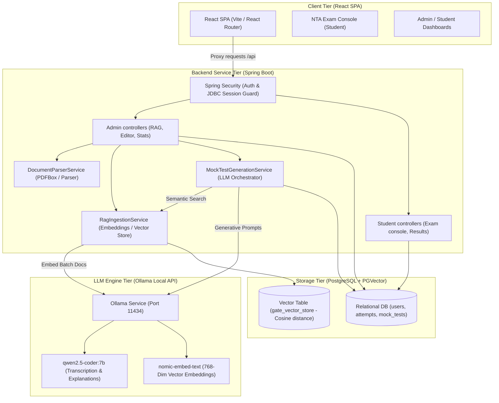
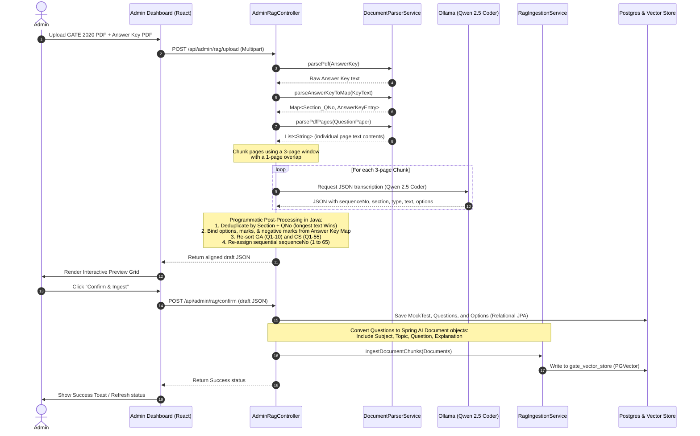
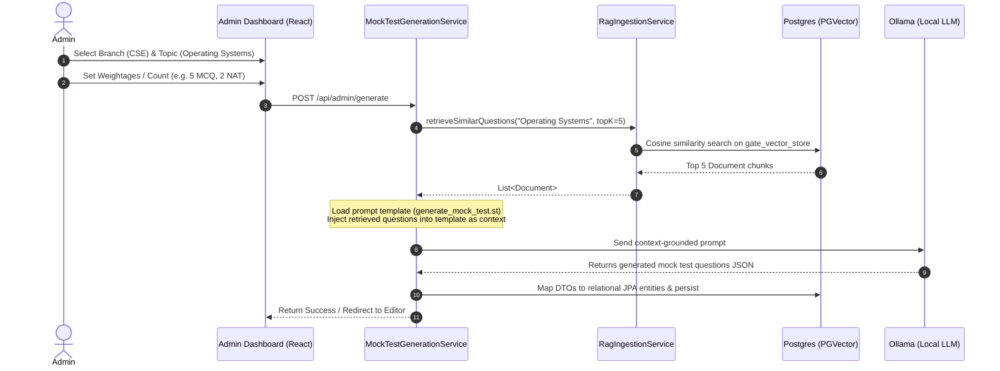

# GATE MockAI: System Architecture & RAG Pipeline Deep-Dive

This document provides a comprehensive, technical walkthrough of the GATE MockAI platform. It covers the overall application architecture, database schemas, frontend-backend communications, and details how the Retrieval-Augmented Generation (RAG) extraction and mock test generation engine works.

---

## 1. System Architecture Overview

GATE MockAI is built as a split-architecture Web application utilizing a modern single-page React frontend, a Spring Boot backend REST API, a PostgreSQL database (supporting `pgvector` for embeddings), and a local Ollama AI engine.

### System Architecture Flow Diagram
The visual diagram below demonstrates the interaction between the React Client Tier, Spring Boot Service Tier, PostgreSQL Storage Tier, and Local Ollama Inference Tier:


### Architecture Layout (Mermaid Model)
For rendering directly in Markdown engines:



---

## 2. In-Depth Database Schema & Relationships

The database is built on PostgreSQL, schema migrations are version-controlled with Flyway, and session states are persisted to prevent administrative timeouts during local AI inference.

### Core Database Schema ERD
The following diagram illustrates table definitions, properties, and entity relationships:


### Database Schema (Mermaid Layout)

```mermaid
erDiagram
    users {
        uuid id PK
        varchar email UNIQUE
        text password_hash
        varchar full_name
        varchar role "ADMIN | STUDENT"
        timestamp created_at
    }
    
    mock_tests {
        uuid id PK
        varchar title
        varchar topic
        varchar subject
        varchar branch
        varchar year_label
        integer duration_minutes
        numeric total_marks
        boolean is_published
        timestamp created_at
    }
    
    questions {
        uuid id PK
        uuid test_id FK
        text question_text
        text image_path
        varchar type "MCQ | MSQ | NAT"
        double correct_nat_value
        double nat_tolerance
        numeric marks
        numeric negative_marks
        integer sequence_no
        text explanation
    }
    
    options {
        uuid id PK
        uuid question_id FK
        char option_label "A | B | C | D"
        text option_text
        text image_path
        boolean is_correct
    }
    
    attempts {
        uuid id PK
        uuid user_id FK
        uuid test_id FK
        numeric score
        timestamp started_at
        timestamp submitted_at
        varchar status "IN_PROGRESS | SUBMITTED | TIMED_OUT"
    }
    
    attempt_answers {
        uuid id PK
        uuid attempt_id FK
        uuid question_id FK
        text selected_option_ids "Comma-separated"
        double nat_value_entered
        boolean is_correct
        numeric marks_awarded
    }
    
    branches {
        uuid id PK
        varchar name
        varchar code UNIQUE
    }
    
    branch_subjects {
        uuid id PK
        uuid branch_id FK
        varchar name
        integer default_marks_weightage
        integer display_order
        boolean is_active
    }

    users ||--o{ attempts : places
    mock_tests ||--o{ questions : contains
    mock_tests ||--o{ attempts : receives
    questions ||--o{ options : has
    attempts ||--o{ attempt_answers : contains
    questions ||--o{ attempt_answers : answered-by
    branches ||--o{ branch_subjects : "defines subjects for"
```

### Table Definitions & Purpose

1. **`users`**: Registers user profiles and segregates privileges using role flags (`ROLE_ADMIN` vs. `ROLE_STUDENT`).
2. **`mock_tests`**: Serves as the parent metadata container for an exam session, linking its topic, duration, publishing state, and total compiled marks.
3. **`questions`**: Stores the questions. Supports Multiple Choice (`MCQ`), Multiple Select (`MSQ`), or Numerical Answer Type (`NAT`). Stores grading criteria (`marks`, `negative_marks`), correctness ranges (`correct_nat_value` and `nat_tolerance` for NATs), and detailed academic explanations.
4. **`options`**: Holds individual options for `MCQ` and `MSQ` questions, using standard labels (A, B, C, D) and a boolean `is_correct` indicator.
5. **`attempts` & `attempt_answers`**: Persists student actions during exam attempts. Tracks live state (answered options, entered numerical values), evaluates responses instantly upon submission, and awards marks based on paper negative marking matrices.
6. **`branches` & `branch_subjects`**: Domain catalog listing branches (e.g., CSE) and corresponding syllabus subjects. Used by generator modules to dynamically distribute subject weightages.
7. **`gate_vector_store`**: Dedicated table instantiated by Spring AI PGVector. Contains the columns:
   - `id`: Unique text chunk identifier.
   - `content`: Combined text corpus containing subject, topic, question text, and academic explanation.
   - `metadata`: JSON payload carrying document attributes (e.g., subject, topic, question type).
   - `embedding`: Vector data type (`vector(768)`) representing the 768-dimensional space generated by the `nomic-embed-text` model.

---

## 3. How RAG works on GATE MockAI

The Retrieval-Augmented Generation (RAG) implementation consists of two core procedures: **Ingestion & Alignment** (parsing past papers into the vector database) and **Generation** (retrieving relevant context to compile new exams).

---

### Part A: Ingestion & Alignment Pipeline (PDF to PGVector)

This pipeline extracts unstructured past exams, matches options programmatically, and stores clean chunks into PGVector.



#### Ingestion Technical Details

* **Overlapping Page Window (3-Page Chunking)**: 
  Instead of slicing the PDF blindly, the system loads pages and groups them into 3-page chunks shifting by 2 pages at a time (e.g., Pages 1–3, 3–5, 5–7). This overlap ensures that if a question starts at the bottom of Page 2 and ends at the top of Page 3, it is fully present in at least one segment block.
* **Simplified LLM Prompts (Transcription Only)**:
  Earlier iterations failed because the LLM tried to parse options, assign marks, and align keys concurrently. This hit context output limits and generated truncated answers. In the new pipeline, the prompt instructs `qwen2.5-coder:7b` strictly to *transcribe* the physical text, options, and question types present in the segment.
* **Programmatic Java Alignment**:
  `DocumentParserService.java` parses the answer key using regular expressions:
  - **Tabular Table rows** (e.g., `1 6 MCQ GA D 1`)
  - **Prefixed manuals** (e.g., `GA 1: D` or `CS 17: 0.125 to 0.125`)
  - **Simple lists** (e.g., `11: A` mapped dynamically to `CS_1` if section is GA context)
  
  The controller maps the transcribed questions to their official answer key entries. Based on the answer key, options are marked `isCorrect`, NAT correct values and tolerances are calculated, and negative marks are assigned (e.g., MCQ 1M = `-0.33`, MCQ 2M = `-0.67`, MSQ/NAT = `0.0`).
* **Length-based Deduplication**:
  Overlapping chunks produce duplicate question copies. The system groups questions by `Section + SequenceNo` and selects the candidate with the longest question text and option count.
* **Sorting & Global Numbering**:
  Questions are sorted putting GA (1 to 10) first, followed by CS (1 to 55). Finally, global sequence numbers are rewritten sequentially from 1 to 65 for the final exam.

---

### Part B: RAG Test Generation Pipeline

When generating mock exams, the system performs dynamic vector searches to ground the AI model with actual GATE questions.



#### Generation Details
1. **Semantic Search retrieval**: The system queries the `gate_vector_store` using cosine similarity search on the topic query. The database returns the top 5 questions closest to the requested topic in semantic vector space.
2. **Context-Grounded Prompting**: The retrieved questions (including their types, structures, and mathematical formatting) are injected into the LLM system prompt under a `{contextQuestions}` placeholder.
3. **Few-Shot Learning**: The local LLM reads this context to understand the expected complexity, formatting, and notation of real GATE exam questions, minimizing generic and overly simplified AI questions.
4. **Relational Persistence**: The generated test JSON is parsed, mapped to database entities (`mock_tests`, `questions`, `options`), and saved to the relational database.

---

## 4. Session & Security Configuration

The platform implements persistent, stateful authentication using Spring Security and JDBC Spring Session.

* **Persistent Sessions**:
  By using `spring.session.store-type: jdbc`, active sessions are saved to the `SPRING_SESSION` table inside PostgreSQL instead of standard in-memory storage. 
  When the backend is rebuilt or restarted (e.g. during development), the admin or student does not lose their session and does not need to re-login.
* **Cookie Serializer**:
  The `SessionConfig` class overrides default cookie properties, setting cookie lifetime to **30 days** (`Max-Age = 2592000` seconds) with a `Lax` SameSite policy, ensuring the authentication state survives browser restarts.
* **Spring Security Rule Set**:
  - `/api/register` is exposed publicly.
  - `/api/admin/**` and `/admin/**` endpoints are protected under the `ADMIN` role.
  - `/api/exam/**`, `/api/student/**`, `/student/**`, and `/exam/**` are protected under the `STUDENT` role.
  - Form logins route users to their respective dashboards based on their role (`customSuccessHandler`).
